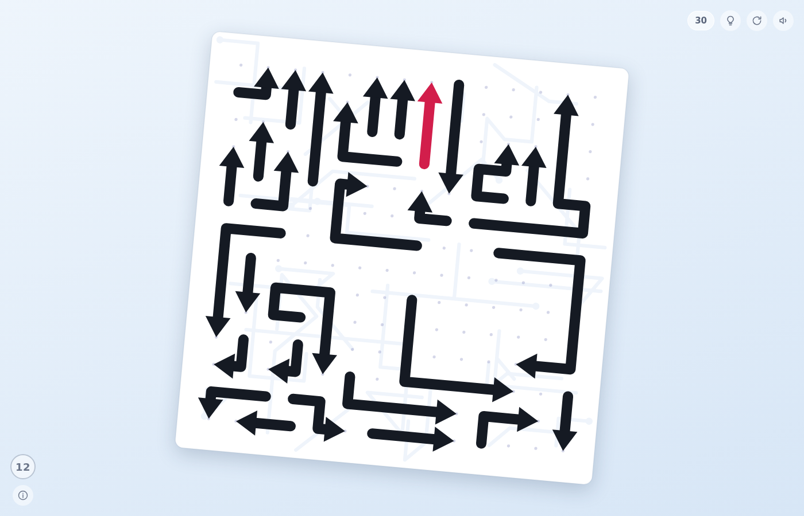

# Unarrow

Łamigłówka logiczna: plansza jest zastawiona strzałkami, a Twoim zadaniem jest
usunąć je wszystkie.



## Zasady

* Kliknij strzałkę — wysunie się ona po swoim torze poza planszę.
* Uda się to **tylko wtedy, gdy prosta droga przed grotem**, aż do krawędzi
  planszy, jest całkowicie pusta.
* Zablokowana strzałka zadrga na czerwono. Najpierw trzeba usunąć to, co stoi
  jej na drodze.
* Usunięcie strzałki jedynie zwalnia pola, więc **układu nie da się zepsuć** —
  każdy poziom zawsze da się dokończyć. Wyzwaniem jest znalezienie kolejności.

Skróty klawiszowe: <kbd>H</kbd> — podpowiedź, <kbd>R</kbd> — plansza od nowa.

## Uruchomienie

Nie ma żadnych zależności ani kroku budowania. Wystarczy otworzyć plik:

```
xdg-open index.html      # albo po prostu przeciągnąć do przeglądarki
```

Opcjonalnie przez lokalny serwer:

```
npx http-server . -p 8080   # potem http://localhost:8080
```

## Jak to działa

### Generowanie plansz

Plansze budowane są **od tyłu**, w `js/generator.js`. Jako pierwszą kładziemy
strzałkę, która zostanie usunięta jako ostatnia. Przy dokładaniu każdej kolejnej
wymagamy, żeby jej tor wyjścia był wolny od strzałek już leżących na planszy.

Dzięki temu kolejność odwrotna do kolejności układania jest z definicji
poprawnym rozwiązaniem — a ponieważ usunięcie strzałki wyłącznie zwalnia pola,
żaden ruch nie może doprowadzić do sytuacji bez wyjścia. Ciała strzałek nigdy
się nie nakładają i nie wchodzą na własny tor wyjścia.

Poziom jest funkcją numeru poziomu (deterministyczny PRNG), więc „poziom 7"
zawsze wygląda tak samo, a przycisk *od nowa* wczytuje tę samą układankę.
Rozmiar siatki rośnie od 9×9 do 17×17, liczba strzałek od 6 do 40.

### Rysowanie

Wszystko jedzie na jednym `<canvas>` w układzie współrzędnych siatki
(1 jednostka = odstęp między punktami), a transformacja canvasu zajmuje się
skalą, wyśrodkowaniem i lekkim przekrzywieniem planszy. Wysuwanie strzałki to
przesuwający się wycinek łamanej `[p, p + długość ciała]` po torze złożonym
z ciała strzałki i prostej wybiegającej poza planszę (`js/geometry.js`).

### Pliki

| plik | rola |
| --- | --- |
| `index.html` | struktura strony i interfejsu |
| `css/style.css` | wygląd interfejsu |
| `js/rng.js` | deterministyczny PRNG (mulberry32) |
| `js/geometry.js` | operacje na łamanych: długość łuku, wycinek, trafianie |
| `js/generator.js` | generator plansz z gwarancją rozwiązywalności |
| `js/sfx.js` | dźwięki syntezowane na WebAudio |
| `js/game.js` | stan gry, rysowanie, obsługa wejścia |

Postęp (numer poziomu, wyciszenie) trzymany jest w `localStorage`.
Do testów automatycznych i debugowania z konsoli udostępniony jest uchwyt
`window.__unarrow`.
